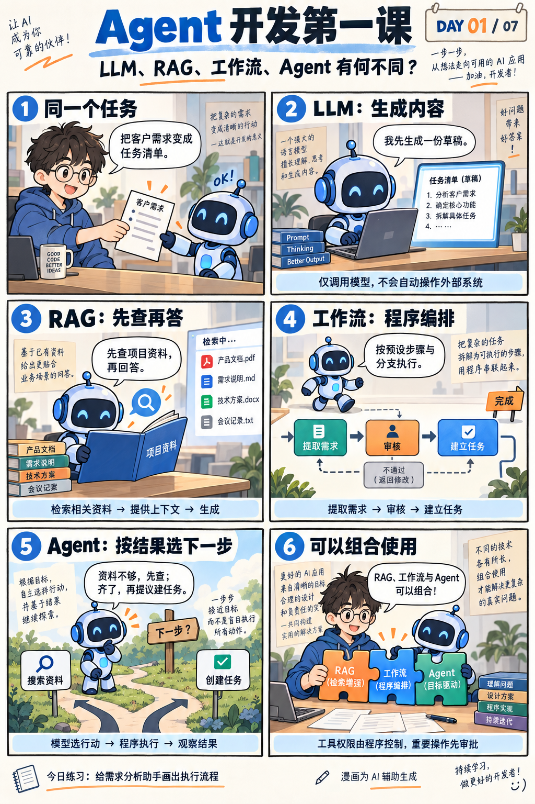

# Day 01｜LLM、RAG、工作流与 Agent / Token、上下文与 Attention

日期：**2026-09-08**（计划学习日期）  
周次：第 1 周 · 模型基础与工具调用  
学习单元：原计划 Day 01 + Day 02

## 单元 1：LLM、RAG、工作流与 Agent

- LLM 提供生成与判断能力；RAG 为生成提供检索到的外部依据。
- 工作流主要由程序预设路线，Agent 在受约束范围内动态选择下一步，四者可以组合。

## 单元 2：Token、上下文与 Attention

- Token 是模型处理文本的单位，并不总与汉字或单词一一对应。
- 自回归生成逐步预测后续 Token；Attention 用于结合上下文信息，长上下文不保证准确。

## 知识配图

漫画为 AI 辅助生成，对应本日单元 1。图中的「DAY 01 / 07」沿用原入门漫画系列标识，不代表新的 42 天学习日程；单元 2 的配图待补充。

## 配套源码

- [审批版本校验示例](src/approval-demo.js)
- [运行说明](src/README.md)

此示例对应程序控制边界，不调用模型或外部工具；单元 2 的源码尚未补充。

---

[总目录](../../README.md) · [知识总览](../../KNOWLEDGE-MAP.md) · [后一天](../2026-09-09-day-02/knowledge.md)
